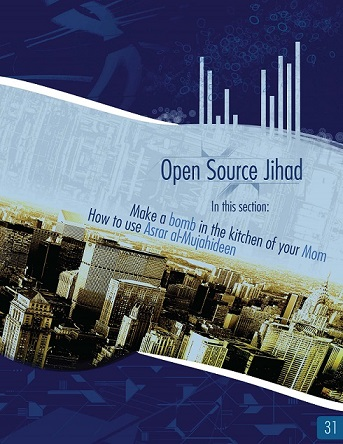

```{r setup, include = FALSE}
library(tidyverse)
library(knitr)
library(plotly)
library(scales)
library(ggthemes)
library(lubridate)
library(knitr)
library(stringr)

knitr::opts_chunk$set(echo = FALSE, warning = FALSE, message = FALSE)

theme_set(theme_minimal())

hist <- read.csv("Data/inspire_issues.csv") %>%
  rename(Issue = `ï..Issue`)
```

> ...And inspire the believers

*Inspire* is an online English-language magazine published by one of al-Qaeda's main franchises, al-Qaeda in the Arabian Peninsula (AQAP). AQAP operates primarily in Yemen and Saudi Arabia, but has drawn attention for attempting various terrorist plots against Western targets in the Arabian peninsula and abroad. Since their creation in 2009, they have attempted multiple times to blow up planes and have conducted numerous deadly attacks against security personnel. In 2015, the group claimed responsibility for the shooting attack on the headquarters of the satirical newspaper Charlie Hebdo in Paris. 



AQAP first published *Inspire* in July 2010, and currently there are 16 issues, the most recent having been issued in November 2016. A principal aim of *Inspire* is to recruit and mobilize helpers from English-speaking countries, and to encourage them to carry out attacks domestically as well as to join their militia in the Middle East. *Inspire* famously dedicates a section of each issue to a concept they call "Open Source Jihad", or detailed how-to-guides for conducting domestic terrorist attacks. Dzhokhar Tsarnaev, the surviving Boston marathon bomber, claimed to have learned bomb-making from one of the *Inspire* guides.

```{r about_table}
table <- hist %>%
  select(Issue, CoverStory, ReleaseDate, TotalPages) %>%
  transform(ReleaseDate = as.Date(ReleaseDate, "%m/%d/%y")) %>%
  mutate(ReleaseYear = as.character(year(ReleaseDate))) %>%
  mutate(ReleaseMonth = month.abb[month(ReleaseDate)]) %>%
  transform(ReleaseDate = paste(ReleaseMonth, ReleaseYear)) %>%
  select(-ReleaseYear, -ReleaseMonth) %>%
  transform(CoverStory = as.character(CoverStory)) %>%
  transform(CoverStory = ifelse(Issue == 3, "$4,200", CoverStory))

table %>%
  kable(format = "html", col.names = c("Issue", "Cover Story", "Release Date", "# Pages"))
```

Below is a timeline of issue releases with major offensives by AQAP and counter-offensives by the US and allies.

```{r timeline}
timeline <- read.csv("Data/timeline.csv") %>%
  transform(Date = as.Date(Date, "%m/%d/%Y")) %>%
  transform(Event = as.character(Event)) %>%
  transform(Event = str_replace_all(Event, "<br />", "\n"))

blue <- "#8DB6CD"

ggplot() + 
  geom_segment(aes(x = Date, y = Disp, xend = Date), data = timeline, yend = 0,
               size = 0.08, alpha = 0.5) + 
  geom_segment(aes(x = Date[1] - 75, y = 0, xend = Date[length(Date)] + 75), data = timeline, yend = 0,
               color = blue, size = 1.2) + 
  geom_segment(aes(x = Date[1] - 75, y = -0.08, xend = Date[1] - 75), data = timeline, yend = 0,
               color = blue, size = 1.2) + 
  geom_segment(aes(x = Date[length(Date)] + 75, y = -0.08, 
                   xend = Date[length(Date)] + 75), data = timeline, yend = 0,
               color = blue, size = 1.2) + 
  geom_text(aes(x = Date, y = Disp, label = Event), data = filter(timeline, Inspire == 1),
            vjust = 1) + 
  geom_text(aes(x = Date, y = Disp, label = Event), data = filter(timeline, Offensive == 1),
            vjust = -0.2, size = 3.2) + 
  geom_text(aes(x = Date, y = Disp, label = Event), data = filter(timeline, CT == 1),
            vjust = -0.2, size = 3.2) + 
  annotate(geom = "text", x = as.Date("1/1/2009", "%m/%d/%Y"), 
           y = -0.6, label = "Inspire Publication\n(Issue)", fontface = "bold") +
  annotate(geom = "text", x = as.Date("1/1/2009", "%m/%d/%Y"), 
           y = 0.8, label = "AQAP Offensives", fontface = "bold") +
  annotate(geom = "text", x = as.Date("1/1/2009", "%m/%d/%Y"), 
           y = 2.4, label = "Counter-terror Ops", fontface = "bold") +
  scale_x_date(limits = c(as.Date("5/1/2008", "%m/%d/%Y"), timeline$Date[length(timeline$Date)] + 90),
               date_breaks = "1 year", date_labels = "%Y") + 
  ylim(-1, 3.5) + 
  labs(title = "Timeline of events") + 
  theme_minimal() + 
  theme(axis.title.x = element_blank(),
    axis.title.y = element_blank(),
        axis.text.y = element_blank(),
        axis.line.y = element_blank(),
    panel.grid.minor.x = element_blank(),
        panel.grid.major.y = element_blank(),
        panel.grid.minor.y = element_blank())
```

Description of events:

* On Christmas Day of 2009, Umar Farouk Abdulmutallab ("Underwear Bomber") attempted and failed to detonate explosives in his underwear while onboard a plane flying to Detroit, Michigan. AQAP claimed to have coordinated the attack.
* etc.