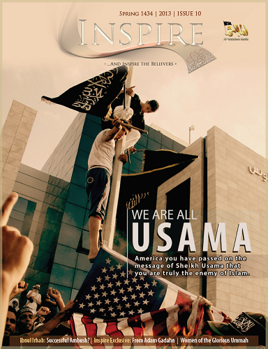

```{r setup, include = FALSE}
library(tidyverse)
library(knitr)
library(plotly)
library(scales)
library(ggthemes)
library(lubridate)
library(stringr)
library(kableExtra)

knitr::opts_chunk$set(echo = FALSE, warning = FALSE, message = FALSE)

theme_set(theme_minimal())

hist <- read.csv("Data/inspire_issues.csv")
```

> ...And inspire the believers

*Inspire* is an online English-language magazine published by one of al-Qaeda's main franchises, al-Qaeda in the Arabian Peninsula (AQAP). AQAP operates primarily in Yemen and Saudi Arabia, but has drawn attention for various terrorist plots against Western targets. Since their founding in 2009, they have carried out numerous deadly attacks, attempted assassinations, conquered territory in Yemen, and incited violence abroad with *Inspire* and other propaganda outlets. Notably, the group made credible claims to have trained and directed the two attackers of the 2015 shooting at headquarters of the satirical newspaper Charlie Hebdo in Paris. 



AQAP published the first issue of *Inspire* in July 2010, and as of mid-2017 there are 16 issues, the most recent published in November 2016. A principal aim of *Inspire* is to recruit and mobilize co-conspirators from English-speaking countries, and to encourage them to carry out attacks domestically as well as to join their militia in the Middle East. *Inspire* famously dedicates a section of each issue to a concept they call "Open Source Jihad", or detailed how-to-guides for conducting domestic terrorist attacks. In fact, the Boston marathon bombers are believed to have used one of these guides to build the bombs used in their attack [1][2].

The following table presents information on each issue, including the release date and number of pages.

```{r about_table}
pubtable <- hist %>%
  select(Issue, CoverStory, ReleaseDate, TotalPages) %>%
  transform(ReleaseDate = as.character(ReleaseDate)) %>%
  transform(ReleaseDate = as.Date(ReleaseDate, "%m/%d/%Y")) %>%
  mutate(ReleaseYear = as.character(year(ReleaseDate))) %>%
  mutate(ReleaseMonth = as.character(month.abb[month(ReleaseDate)])) %>%
  transform(ReleaseDate = paste(ReleaseMonth, ReleaseYear)) %>%
  select(-ReleaseYear, -ReleaseMonth) %>%
  transform(CoverStory = as.character(CoverStory)) %>%
  transform(CoverStory = ifelse(Issue == 3, "$4,200", CoverStory))

ktable <- pubtable %>%
  kable(format = "html", col.names = c("Issue", "Cover Story", "Release Date", "# Pages"), align = 'l', table.attr = "style='width:100%;'")

ktable %>%
  kable_styling(bootstrap_options = c("hover", "condensed"))
```

Below is a timeline of issue releases with major offensives by AQAP and counter-offensives by the US and allies. Hover over the colored dots to learn more.

```{r timeline}
timeline2 <- read.csv("Data/timeline2.csv") %>%
  transform(Date = as.Date(Date, "%m/%d/%Y")) %>%
  transform(Event = as.character(Event)) %>%
  transform(Event = str_replace_all(Event, "<br />", "\n")) %>%
  transform(Type = factor(Type, levels = c("Counter-terror operation",
                                           "AQAP offensive",
                                           "Inspire publication"))) %>%
  mutate(DescriptionDate = ifelse(Type == "Inspire publication",
                                  paste(month(Date, label=TRUE, abbr=FALSE), year(Date)),
                                  paste0(month(Date, label=TRUE, abbr=FALSE), " ", day(Date), ", ", 
                                  year(Date)))) %>%
  transform(DescriptionDate = paste0(DescriptionDate, ":\n\n")) %>%
  transform(Description = paste0(DescriptionDate, Description)) %>%
  transform(Description = str_replace_all(Description, "<br />", "\n"))

years <- data.frame(c("1/1/2010", "1/1/2011", "1/1/2012", "1/1/2013", "1/1/2014", "1/1/2015",
           "1/1/2016", "1/1/2017"))
colnames(years) <- "date"
years <- years %>%
  transform(date = as.Date(date, "%m/%d/%Y"))

timeline <- ggplot() + 
  geom_segment(aes(x = Date, y = Disp2, xend = Date), data = timeline2, yend = 0,
               size = 0.08, alpha = 0.5) + 
  geom_segment(aes(x = Date[1] - 60, y = 0, xend = Date[length(Date)] + 60), data = timeline2, yend = 0,
               size = 0.08, alpha = 0.5) + 
  geom_segment(aes(x = Date[1] - 60, y = -0.1, xend = Date[1] - 60), data = timeline2, yend = 0,
               size = 0.08, alpha = 0.5) + 
  geom_segment(aes(x = Date[length(Date)] + 60, y = -0.1, 
                   xend = Date[length(Date)] + 60), data = timeline2, yend = 0,
               size = 0.08, alpha = 0.5) + 
  #year lines
  geom_segment(aes(x = date, y = 0, xend = date, yend = -.1), data = years, size = 0.08, alpha = 0.5) + 
  geom_point(aes(x = Date, y = Disp2, color = Type), data = timeline2, size = 2) +
  #angle doesn't work in plotly
  geom_text(aes(x = Date, y = Disp2, label = Event), 
            data = filter(timeline2, Type == "AQAP offensive"),
            size = 3.2, nudge_y = 0.3) + 
  geom_text(aes(x = Date, y = Disp2, label = Event), 
            data = filter(timeline2, Type == "Counter-terror operation"),
            size = 3.2, nudge_y = 0.3) + 
  scale_color_manual(values = c("#468DFF", "#CC2810", "#C3FF1C")) + 
  scale_x_date(limits = c(timeline2$Date[1] - 90, timeline2$Date[length(timeline2$Date)] + 90),
               date_breaks = "1 year", date_labels = "%Y") + 
  ylim(-0.1, 4.5) + 
  labs(title = "A timeline of events") + 
  theme_minimal() + 
  theme(axis.title.x = element_blank(),
    axis.title.y = element_blank(),
        axis.text.y = element_blank(),
        axis.line.y = element_blank(),
    panel.grid.minor.x = element_blank(),
    panel.grid.major.x = element_blank(),
        panel.grid.major.y = element_blank(),
        panel.grid.minor.y = element_blank())

ptimeline <- plotly_build(timeline)

ptimeline$x$layout$autosize <- FALSE
ptimeline$x$layout$width <- 700
ptimeline$x$layout$height <- 432

ptimeline$x$layout$legend$x <- c(0.55)
ptimeline$x$layout$legend$y <- c(1)
ptimeline$x$layout$annotations[[1]]$legendTitle <- FALSE
ptimeline$x$layout$annotations[[1]]$text <- NULL
ptimeline$x$layout$annotations[[1]] <- NULL

#lists of descriptions based on event type
ct_desc <- timeline2 %>%
  filter(Type == "Counter-terror operation") %>%
  select(Description) %>%
  transform(Description = as.character(Description))
ct_desc <- c(ct_desc)

offensive_desc <- timeline2 %>%
  filter(Type == "AQAP offensive") %>%
  select(Description) %>%
  transform(Description = as.character(Description))
offensive_desc <- c(offensive_desc)

pub_desc <- timeline2 %>%
  filter(Type == "Inspire publication") %>%
  select(Description) %>%
  transform(Description = as.character(Description))
pub_desc <- c(pub_desc)

ptimeline$x$data[[1]]$text <- ""
ptimeline$x$data[[2]]$text <- ""
ptimeline$x$data[[3]]$text <- ""
ptimeline$x$data[[4]]$text <- ""
ptimeline$x$data[[5]]$text <- ""
#counter-terror events
ptimeline$x$data[[6]]$text[1] <- ct_desc$Description[[1]]
ptimeline$x$data[[6]]$text[2] <- ct_desc$Description[[2]]
ptimeline$x$data[[6]]$text[3] <- ct_desc$Description[[3]]
ptimeline$x$data[[6]]$text[4] <- ct_desc$Description[[4]]
ptimeline$x$data[[6]]$text[5] <- ct_desc$Description[[5]]
#AQAP offensive events
ptimeline$x$data[[7]]$text[1] <- offensive_desc$Description[[1]]
ptimeline$x$data[[7]]$text[2] <- offensive_desc$Description[[2]]
ptimeline$x$data[[7]]$text[3] <- offensive_desc$Description[[3]]
ptimeline$x$data[[7]]$text[4] <- offensive_desc$Description[[4]]
ptimeline$x$data[[7]]$text[5] <- offensive_desc$Description[[5]]
ptimeline$x$data[[7]]$text[6] <- offensive_desc$Description[[6]]
ptimeline$x$data[[7]]$text[7] <- offensive_desc$Description[[7]]
ptimeline$x$data[[7]]$text[8] <- offensive_desc$Description[[8]]
#publication events
ptimeline$x$data[[8]]$text[1] <- pub_desc$Description[[1]]
ptimeline$x$data[[8]]$text[2] <- pub_desc$Description[[2]]
ptimeline$x$data[[8]]$text[3] <- pub_desc$Description[[3]]
ptimeline$x$data[[8]]$text[4] <- pub_desc$Description[[4]]
ptimeline$x$data[[8]]$text[5] <- pub_desc$Description[[5]]
ptimeline$x$data[[8]]$text[6] <- pub_desc$Description[[6]]
ptimeline$x$data[[8]]$text[7] <- pub_desc$Description[[7]]
ptimeline$x$data[[8]]$text[8] <- pub_desc$Description[[8]]
ptimeline$x$data[[8]]$text[9] <- pub_desc$Description[[9]]
ptimeline$x$data[[8]]$text[10] <- pub_desc$Description[[10]]
ptimeline$x$data[[8]]$text[11] <- pub_desc$Description[[11]]
ptimeline$x$data[[8]]$text[12] <- pub_desc$Description[[12]]
ptimeline$x$data[[8]]$text[13] <- pub_desc$Description[[13]]
ptimeline$x$data[[8]]$text[14] <- pub_desc$Description[[14]]
ptimeline$x$data[[8]]$text[15] <- pub_desc$Description[[15]]
ptimeline$x$data[[8]]$text[16] <- pub_desc$Description[[16]]

#cleanup
ptimeline$x$data[[9]]$hovertext <- NULL
ptimeline$x$data[[10]]$hovertext <- NULL

ptimeline
```

### References
  1. Khan, Azmat. "The Magazine that "Inspired" the Boston Bombers." PBS. April 30, 2013. http://www.pbs.org/wgbh/frontline/article/the-magazine-that-inspired-the-boston-bombers/.
  2. Valdmanis, Richard. "Boston bomb suspect influenced by Al Qaeda: expert witness." Reuters. March 23, 2015. Accessed June 04, 2017. http://www.reuters.com/article/us-boston-bombings-trial-idUSKBN0MJ0Z620150323.
